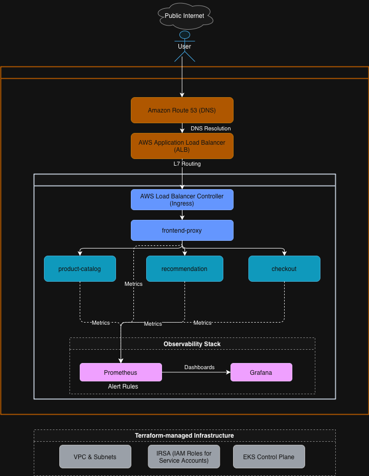

i# Cloud-Native E-Commerce Platform

A production-grade microservices platform running on AWS EKS with full observability, GitOps deployment, and infrastructure as code.

This project demonstrates end-to-end platform engineering: infrastructure provisioning, deployment automation, monitoring with failure validation, and safe release management.

---

## Architecture

The platform runs 19 microservices on Amazon EKS. Infrastructure is provisioned with Terraform. Deployments follow GitOps principles using ArgoCD, with GitHub Actions handling CI.



### Request Flow
```
User
→ Route53 (DNS)
→ AWS Application Load Balancer (ALB)
→ AWS Load Balancer Controller (Ingress)
→ Kubernetes Service
→ Pod
→ Application Container
```

External traffic routes through Route53 to an AWS ALB, which forwards to the AWS Load Balancer Controller (Ingress). The ingress routes requests to Kubernetes services based on path rules, which then load-balance across healthy pods.

---

## Tech Stack

**Infrastructure:**
- AWS (EKS, VPC, Route53, ALB)
- Terraform for infrastructure as code
- IRSA (IAM Roles for Service Accounts) for secure pod-level permissions

**Container Orchestration:**
- Kubernetes on Amazon EKS
- Helm for package management
- AWS Load Balancer Controller (Ingress) for L7 routing

**CI/CD:**
- GitHub Actions for continuous integration
- ArgoCD for continuous deployment (GitOps)
- Git as single source of truth

**Observability:**
- Prometheus for metrics collection
- Grafana for visualization and dashboards
- Custom alerts for failure detection

---

## Documentation

### Core Operations (Deep Dives)
- [Observability & Alerting](docs/observability.md) - Monitoring strategy with failure validation
- [Helm Deployment](docs/helm.md) - Safe upgrade and rollback workflows
- [CI/CD Deep Dive](docs/ci-cd-deep-dive.md) - Separated CI/CD with GitOps

### Platform Foundations
- [Containerization](docs/foundations/containerization.md) - Docker multi-stage builds
- [Infrastructure](docs/foundations/terraform.md) - Terraform provisioning
- [Kubernetes Orchestration](docs/foundations/kubernetes.md) - K8s deployment patterns
- [DNS & External Access](docs/foundations/dns-route53.md) - Route53 configuration

### Engineering Context
- [Lessons Learned](docs/lessons-learned.md) - What changed how I think
- [Architecture Tradeoffs](docs/tradeoffs.md) - Design decisions and rationale

---

## Key Features

### Observability with Failure Validation

Built a complete observability layer with Prometheus and Grafana:
- Three custom dashboards (cluster health, application health, failure signals)
- Alert rules for pod restarts and high CPU usage
- Validated by intentionally triggering OOMKill failures and proving the monitoring caught them in real-time

See [observability documentation](docs/observability.md) for details.

### Helm Packaging

Packaged the product-catalog service with Helm to demonstrate controlled deployment workflows:
- Parameterized configuration via `values.yaml`
- Validated install, upgrade, and rollback lifecycle
- Demonstrates safe deployment practices

See [Helm documentation](docs/helm.md) for details.

### GitOps Deployment

ArgoCD continuously monitors Git and reconciles cluster state:
- Git is the single source of truth
- Manual cluster changes are detected and corrected
- Rollback is a simple `git revert`
- Cluster credentials never leave the cluster

See [CI/CD deep dive](docs/ci-cd-deep-dive.md) for details.

---

## Cost Management

EKS clusters are expensive to run continuously. Infrastructure is provisioned on demand using Terraform and destroyed when not needed:
```bash
# Provision
cd terraform && terraform apply

# Deploy application
kubectl apply -f kubernetes/manifests/

# Destroy
cd terraform && terraform destroy
```

For demonstrations and interviews, architecture diagrams, documentation, and screenshots replace permanently running infrastructure.

---

## CI/CD Flow

**Continuous Integration (GitHub Actions):**
1. Code change triggers workflow
2. Docker image is built and pushed to registry
3. Kubernetes manifests are updated with new image tag

**Continuous Deployment (ArgoCD):**
4. ArgoCD detects manifest change in Git
5. Cluster state is synchronized automatically
6. Deployment completes with zero manual intervention

This separation keeps CI simple and cluster credentials isolated.

---

## Failure Scenarios & Recovery

**Pod crashes:**
- Kubernetes automatically restarts the pod
- Liveness probes detect failures
- Observability dashboards show restart spikes

**Node failures:**
- Pods are rescheduled onto healthy nodes
- Service discovery updates automatically

**Bad deployments:**
- Helm rollback to previous version
- ArgoCD syncs to last known good Git commit

**Configuration errors:**
- Pods may enter CrashLoopBackOff
- Debug with: `kubectl logs`, `kubectl describe pod`

---

## What I Learned

This project taught me that DevOps isn't about knowing more tools—it's about understanding where systems fail quietly.

Most issues weren't complex bugs. They were small misconfigurations with large effects. This shifted my debugging approach from "why isn't this working" to "what assumption did I just make that isn't true?"

See [lessons learned](docs/lessons-learned.md) for detailed reflections.

---

## Certifications

- Certified Kubernetes Administrator (CKA)
- Certified Kubernetes Application Developer (CKAD)
- AWS Certified Solutions Architect – Associate
- HashiCorp Terraform Associate
- AWS Certified Cloud Practitioner

---

## Quick Start

### Prerequisites
- AWS CLI configured
- kubectl installed
- Terraform installed

### Deploy Infrastructure
```bash
cd terraform
terraform init
terraform apply
```

### Configure kubectl
```bash
aws eks update-kubeconfig --region ap-south-1 --name my-eks-cluster
```

### Deploy Application
```bash
kubectl apply -f kubernetes/manifests/
```

### Access Application
Application is accessible via custom domain configured through Route53.

---

## Repository Structure
```
.
├── terraform/              # Infrastructure as code
├── kubernetes/            # K8s manifests and configs
├── helm/                  # Helm charts
├── .github/workflows/     # CI pipelines
├── docs/                  # Documentation
│   ├── foundations/       # Platform foundations
│   ├── observability.md   # Monitoring deep dive
│   ├── helm.md           # Helm deployment
│   ├── ci-cd-deep-dive.md # CI/CD architecture
│   ├── lessons-learned.md # Project learnings
│   └── tradeoffs.md      # Design decisions
└── screenshots/          # Evidence and validation
    ├── foundations/      # Infrastructure proofs
    ├── observability/    # Monitoring screenshots
    ├── helm/            # Deployment lifecycle
    └── cicd/            # Pipeline execution
```

---

## Project Background

This project was built to demonstrate production-grade DevOps practices for Kubernetes-based microservices. The architectural patterns were learned from a comprehensive DevOps course, which I extended with:

- Complete observability layer with custom dashboards and failure validation
- Helm packaging with lifecycle management
- Comprehensive documentation and testing

The observability layer, failure validation, deployment strategy, and production thinking represent my independent work building on foundational patterns.
