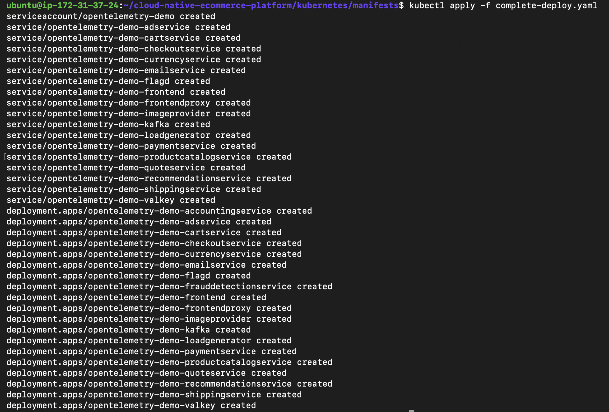

# Kubernetes Deployment

All microservices run on Kubernetes using standard deployment manifests.

## What Kubernetes manages

- Pod scheduling and lifecycle
- Service discovery between components
- Automatic pod restarts on failure
- Rolling updates during deployments

## Validation

The complete application stack deployed successfully to the cluster.

