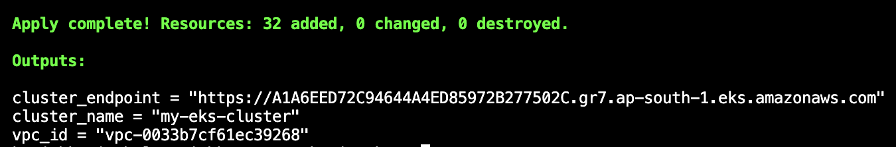

# Infrastructure Provisioning

Infrastructure is managed with Terraform to keep deployments repeatable and enable easy teardown.

## What was provisioned

- VPC with public and private subnets
- EKS cluster
- Managed node groups
- IAM roles for service accounts (IRSA)

## Why Terraform

Terraform keeps infrastructure declarative and version-controlled. More importantly, it lets me destroy everything cleanly when not needed, which keeps AWS costs manageable for a demo project.

## Validation

Infrastructure was provisioned successfully.

