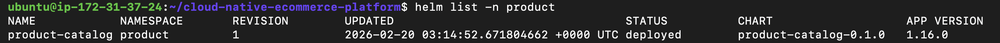
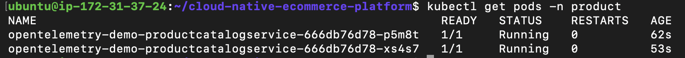
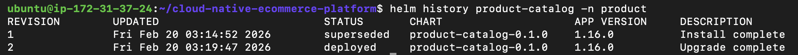

# Helm Deployment

## Why I added Helm

As the project grew, managing raw Kubernetes YAML became harder to maintain. Every config change meant editing files manually, and I had no easy way to roll back if something broke.

Helm packages everything together with a clean `values.yaml` file for configuration, making deployments repeatable and safer.

## What I Helm-ified

Only the **product-catalog** service.

Helm-ifying all services would be repetitive and wouldn’t add additional architectural value beyond the demonstrated pattern.

The chart includes:
- Deployment manifest
- Service manifest

## What's configurable

I parameterized only the values that change between environments:
```yaml
replicaCount: 3

image:
  repository: abhishekf5/product-catalog
  tag: "13134113508"

resources:
  requests:
    cpu: "100m"
    memory: "128Mi"
  limits:
    cpu: "500m"
    memory: "256Mi"
```

Everything else stays hardcoded in the templates.

## Deployment workflow

**Install:**
```bash
helm install product-catalog ./helm/product-catalog -n product
```





---

**Upgrade:**

I changed `replicaCount` from 2 to 3 in `values.yaml` and ran:
```bash
helm upgrade product-catalog ./helm/product-catalog -n product
```



---

**Rollback:**

I tested rollback to verify recovery:
```bash
helm rollback product-catalog 1 -n product
```


## Why Helm over raw YAML

- Configuration in one `values.yaml` file instead of scattered across multiple YAMLs
- Every deployment creates a versioned release
- Rollback is one command instead of manually reapplying old files
- Same chart works across dev/staging/prod with different values

## What I'd add in production

- Separate values files for different environments
- Integrate Helm into CI/CD pipeline
- Add pre-upgrade validation to catch bad configurations early
