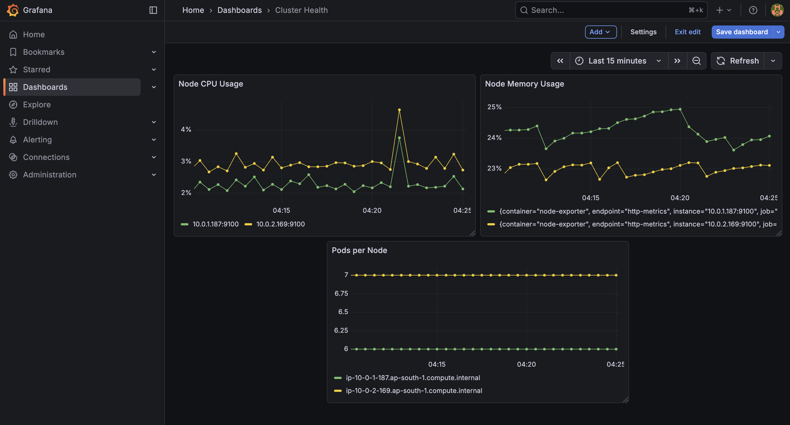
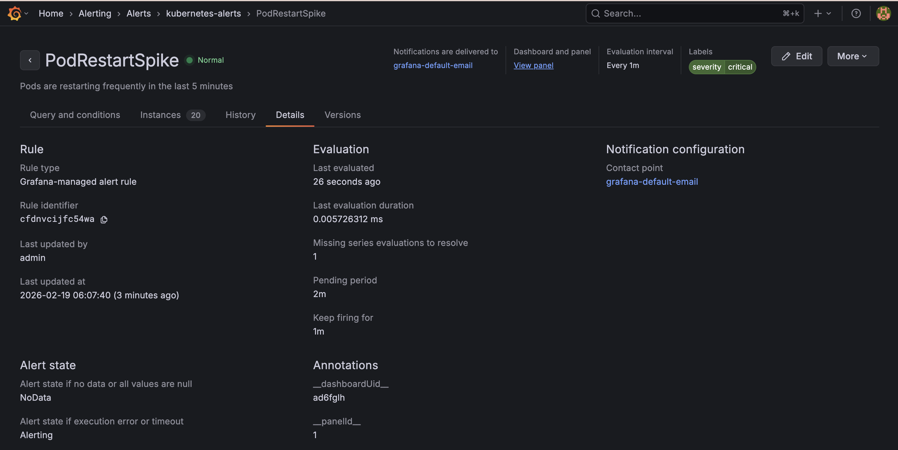
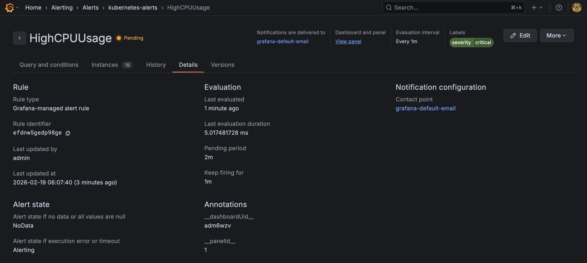
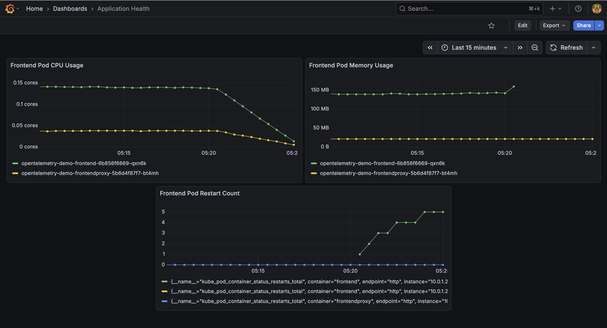
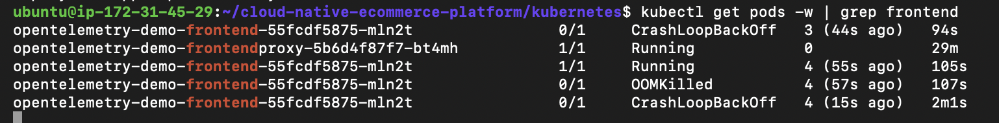
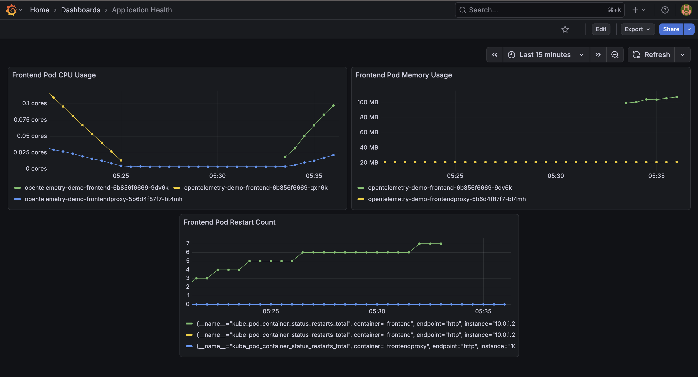
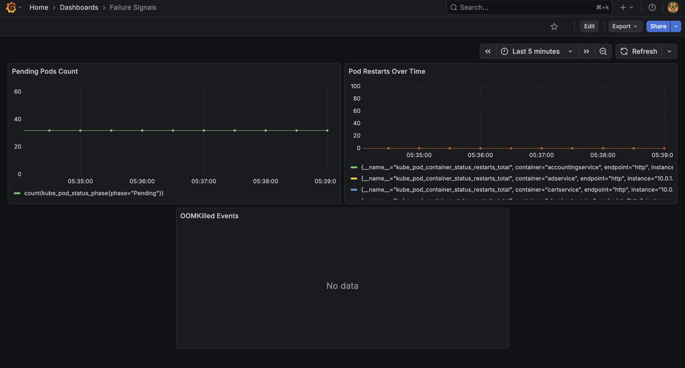
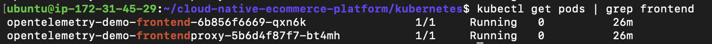

# Observability & Alerting

Observability was added because the base project lacked visibility into cluster and application health. In a production system, this makes debugging slow and risky since failures are only detected after users are impacted.

---

## Dashboards

### Application Health Dashboard

Monitors frontend service health:
- Pod CPU usage
- Pod memory working set  
- Pod restart count


---

### Failure Signals Dashboard

Detects abnormal behavior:
- Pending pod count
- Restart spikes over time
- OOMKilled events


---

### Cluster Health Dashboard

Node-level resource visibility:
- Node CPU usage
- Node memory available
- Pod distribution across nodes



---

## Alerting Strategy

### Alert 1: Pod Restart Spike

**Alert condition:**
```promql
increase(kube_pod_container_status_restarts_total[5m]) > 2
```

**Why this alert exists:**  
Frequent pod restarts indicate application crashes, OOMKills, or misconfigured resource limits and directly affect service availability.

**Action I'd take:**
- Check pod logs using `kubectl logs` for crash reasons
- Run `kubectl describe pod` to identify OOMKilled events
- Review memory and CPU limits in deployment spec
- Roll back recent changes if the issue started after a deployment



---

### Alert 2: High CPU Usage

**Alert condition:**
```promql
rate(container_cpu_usage_seconds_total[5m]) > 0.8
```

**Why this alert exists:**  
Sustained high CPU usage causes request latency, CPU throttling, and can trigger cascading failures across dependent services.

**Action I'd take:**
- Identify which pods are consuming high CPU
- Check if traffic increased suddenly (load-related)
- Verify HorizontalPodAutoscaler is working correctly
- Adjust resource requests if pods are under-provisioned



---

## Failure Validation

To validate the observability setup actually detects real failures, I intentionally restricted the frontend pod memory limit from 250Mi to 50Mi. This was designed to trigger OOMKill events.

### During Failure

The frontend pod entered CrashLoopBackOff within 60 seconds:
- Restart count increased from 0 to 3
- Pod status showed `OOMKilled` in termination reason
- Failure signals dashboard showed restart spike
- Pod restart alert transitioned to Firing state






---

### Recovery

After reverting the memory limit back to 512Mi:
- Pod stabilized in under 2 minutes
- Restart count stopped increasing
- All metrics returned to normal baseline
- Alert resolved automatically







---

## What I Validated

- Dashboards updated in real-time during the failure (within 30 seconds)
- Pod restart alert transitioned correctly: Normal → Pending → Firing
- Recovery was visible in dashboards within 2 minutes of fix
- Historical data preserved in Prometheus for post-incident analysis
- Alert automatically resolved when pod stabilized

---

## What I'd Add in Production

- **Alertmanager** for routing alerts to Slack or PagerDuty instead of just Prometheus UI
- **Distributed tracing** with Jaeger or Tempo to track requests across all the micro-services
- **SLO-based alerts** focused on user-facing metrics (error rate, latency) rather than just resource usage
- **Log aggregation** with Loki to correlate metrics with application logs during incidents
